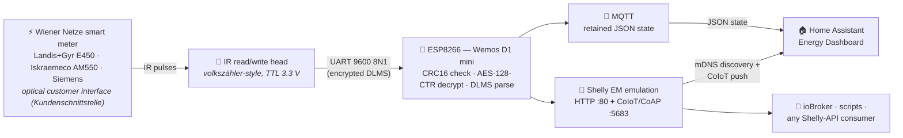
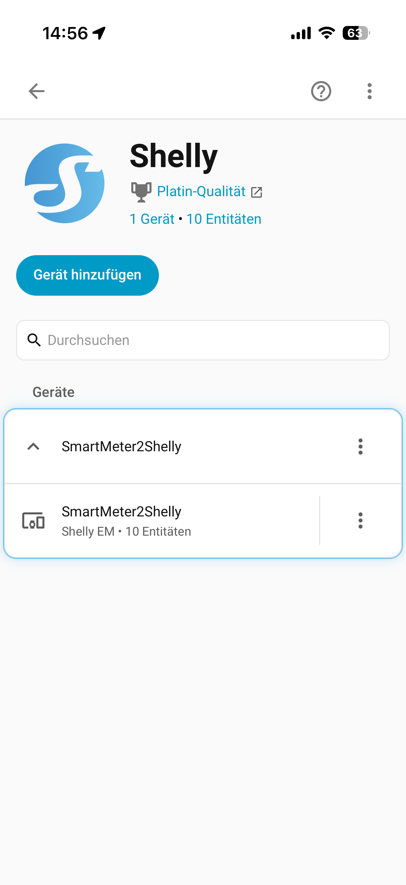
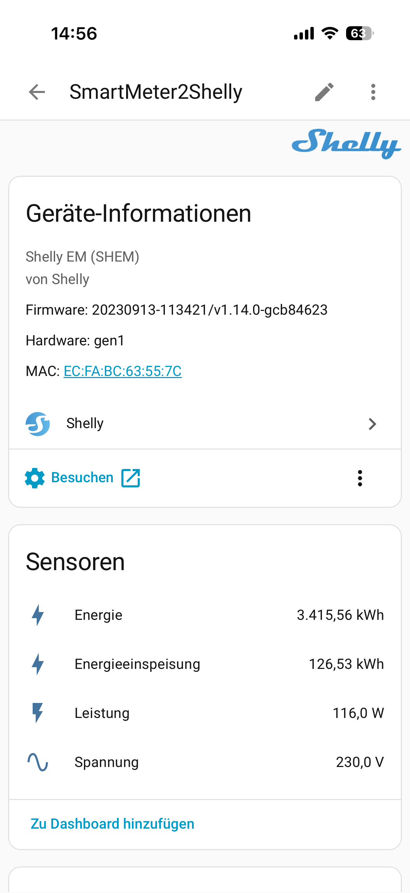
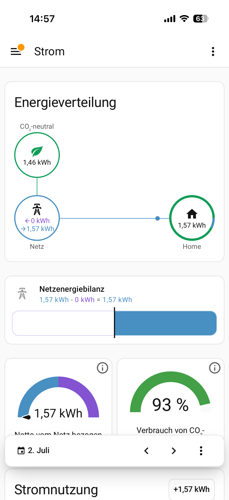
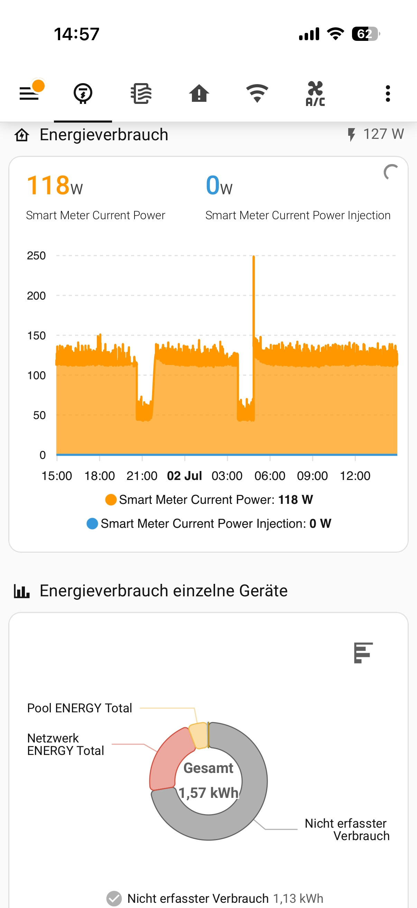
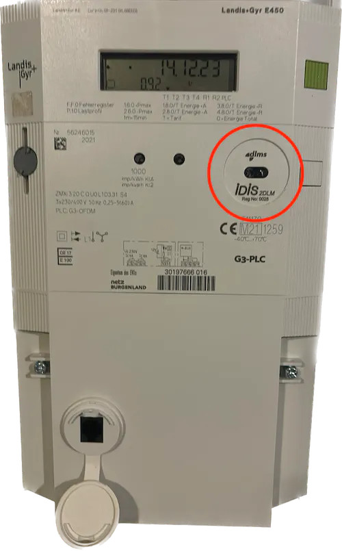
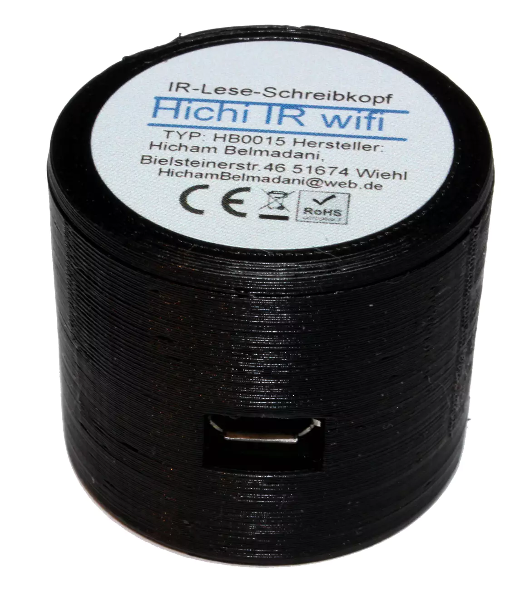
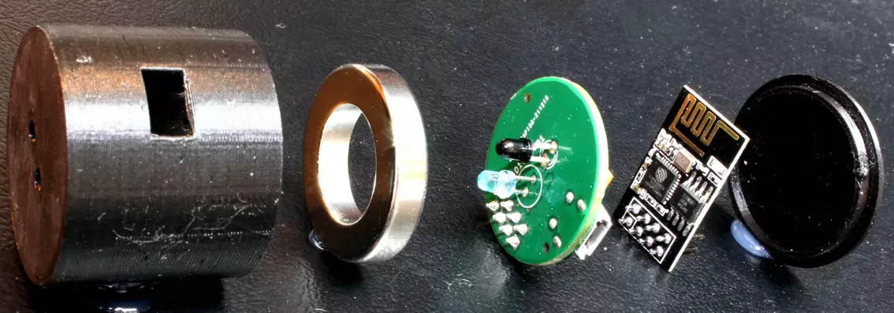

# SmartMeter2Shelly — Wiener Netze edition ⚡

**Turn your Wiener Netze smart meter into a Shelly EM.**

ESP8266 firmware that reads your meter's optical customer interface, decrypts
the data on-device, and re-exports it as a **Shelly EM** — so Home Assistant
(and anything else that speaks the Shelly API) discovers your grid meter like
an off-the-shelf energy monitor. An **MQTT** JSON feed is available too, plus
**OTA updates** and **live logs over telnet**.




## Why?

Wiener Netze smart meters expose real-time readings on their optical customer
interface (Kundenschnittstelle) — but encrypted, in DLMS frames, on an IR port.
Existing projects decode this to MQTT; this one goes a step further and
**impersonates a Gen1 Shelly EM** (HTTP + CoIoT). That means:

- 🔍 **Zero-config discovery** — Home Assistant finds it via mDNS like a real Shelly.
- 🔌 **Energy Dashboard ready** — grid import *and* return, out of the box.
- 🏠 **Works beyond HA** — any Shelly-API consumer (ioBroker, custom scripts, …) can read it.
- 📡 **MQTT too** — retained JSON state with OBIS-style keys, if you prefer (or want both).

## In Home Assistant

Home Assistant sees a genuine Shelly EM — auto-discovered by the official
Shelly integration, live power via CoIoT push, and grid import/return feeding
the Energy Dashboard:

| Auto-discovered as a Shelly EM | Device page with live sensors |
|:---:|:---:|
|  |  |

| Energy Dashboard — grid → home | Live power history |
|:---:|:---:|
|  |  |

## Features

- ✅ Reads the meter's push data via an optical IR read head (9600 8N1)
- ✅ CRC16/X25 frame check + AES-128-CTR decryption on-device
- ✅ Energy (import/export, active/reactive) and live power registers
- ✅ Gen1 **Shelly EM** emulation: HTTP API on `:80` + CoIoT/CoAP push on `:5683`
- ✅ **MQTT** retained JSON state with availability (LWT)
- ✅ **OTA updates** — flash over USB once, then update over WiFi forever
- ✅ **Telnet log** (`telnet smartmeter2shelly.local`) — watch it live, no cable
- ✅ Every output is a compile-time toggle; disabled features cost zero flash/RAM

## What you need

| Part | Notes |
|------|-------|
| **Wemos D1 mini (ESP8266)** | ~3 €; or a clone / other ESP8266 board with pin care |
| **Optical IR read/write head** | **TTL/UART type at 3.3 V** — the [volkszähler IR-Schreib-Lesekopf](https://wiki.volkszaehler.org/hardware/controllers/ir-schreib-lesekopf) design or compatible |
| **Your meter's decryption key** | free from the [Wiener Netze portal](https://smartmeter-web.wienernetze.at) — see below |
| [PlatformIO](https://platformio.org/) | CLI or VS Code extension |

<p>
  
  &nbsp;&nbsp;
  
  <br>
  <sub>Left: a Landis+Gyr E450 — the round <b>optical customer interface</b>
  (circled) is where the head docks. Right: an IR read/write head — a small
  puck that snaps onto the meter's metal ring with its built-in magnet.</sub>
</p>

### About the IR read head

Wiener Netze meters expose their data on an optical interface: an IR LED
behind a small window, with a metal ring around it. The read head is a small
puck with an IR photodiode (+ LED for the write direction, unused here) that
**attaches to that ring with its built-in magnet** and converts the light
pulses to a plain UART signal.

<p>
  
  <br>
  <sub>Inside a typical head (here a "Hichi"-style unit, disassembled):
  3D-printed housing · ring magnet that grips the meter · IR sensor PCB ·
  and, in the WiFi variant, a piggybacked ESP-01 module.</sub>
</p>

The de-facto standard design is the volkszähler project's
[**IR-Schreib-Lesekopf**](https://wiki.volkszaehler.org/hardware/controllers/ir-schreib-lesekopf)
— their wiki has schematics, a DIY guide, and links to ready-made heads
(also commonly sold on eBay/Tindie as "Hichi" / "IR Lesekopf TTL").

⚠️ **Get the TTL/UART variant, not USB.** The head must output raw 3.3 V UART
for the ESP8266 — USB heads only work on a PC/Raspberry Pi.

Supported meters: **Landis+Gyr E450** and **Iskraemeco AM550** (default), plus
**Siemens** via a build flag — see [Meter brand](#meter-brand).

## Quick start

**1. Get your decryption key.** Log in at
[smartmeter-web.wienernetze.at](https://smartmeter-web.wienernetze.at) and
request the key for your meter (it's per-meter, 16 bytes / 32 hex chars).

**2. Wire the IR head** ([TTL variant!](#about-the-ir-read-head)) to the D1 mini:

| IR head | D1 mini     |
|---------|-------------|
| VCC     | 3V3         |
| GND     | GND         |
| RX      | GPIO13 (D7) |
| TX      | GPIO15 (D8) |

*(Not the usual TX/RX pins — see [UART layout](#uart-layout--reading-logs) for why.)*

**3. Configure your secrets:**

```bash
cp include/secrets.h.example include/secrets.h
```

Fill in the AES `KEY`, WiFi credentials, OTA hostname/password, and (if you
use MQTT) the broker settings. `secrets.h` is gitignored — it never leaves
your machine.

**4. Build & flash:**

```bash
pio run -t upload      # first flash over USB
```

**5. Attach the IR head to the meter** (it snaps onto the metal ring
magnetically) and watch it work:

```bash
telnet smartmeter2shelly.local
```

**6. Add it to Home Assistant.** Go to **Settings → Devices & Services** — the
device shows up auto-discovered as a Shelly EM (`shellyem-<MAC>`). Add its
channels to the Energy Dashboard as grid consumption/return. Done. 🎉

### OTA updates (after the first flash)

The device is always OTA-updatable once on WiFi. In
[platformio.ini](platformio.ini), comment `upload_protocol = esptool` and
uncomment the `espota` block (set `upload_port` to the device IP or
`smartmeter2shelly.local`, and `--auth` only if you set an `OTA_PASSWORD`).
Then `pio run -t upload` flashes wirelessly.

## Configuration

All feature toggles live in [include/config.h](include/config.h) (tracked in
git; credentials stay in `secrets.h`). Edit, re-flash (OTA is fine) — disabled
features are compiled out entirely, freeing flash and RAM.

| Toggle | Default | What it does |
|--------|---------|--------------|
| `ENABLE_SERIAL_LOG` | 1 | Local debug log on UART1 (`Serial1` / GPIO2) |
| `ENABLE_TELNET_LOG` | 1 | Debug log over WiFi (telnet, port 23) |
| `ENABLE_SHELLY_EM`  | 1 | Shelly EM emulation (HTTP + CoIoT) for HA |
| `ENABLE_MQTT`       | 1 | Publish readings to MQTT (broker in `secrets.h`) |

`MQTT_PUBLISH_INTERVAL_MS` (default 3000) sets the MQTT publish cadence.

## Shelly EM emulation (Home Assistant)

With `ENABLE_SHELLY_EM`, the device emulates a Gen1 Shelly EM (`SHEM`, one
bidirectional emeter channel):

- **mDNS discovery** as `shellyem-<MAC>` — HA's Shelly integration picks it up
  automatically, or add it manually by IP.
- **HTTP API** on port 80: `/shelly`, `/status`, `/settings`, `/emeter/0`,
  `/cit/d`, `/cit/s`, and friends.
- **CoIoT/CoAP** on port 5683: live status pushed to multicast, so HA updates
  in near-real-time without polling.
- The Energy Dashboard sees both grid **import** (`+A`) and **return** (`-A`).

The emulation was validated against
[aioshelly](https://github.com/home-assistant-libs/aioshelly), the exact
library HA uses.

> **Nice detail:** the Shelly comes online only *after* the first valid meter
> frame, so it never advertises a `0` energy reading that HA's
> `total_increasing` sensor would misread as a meter reset.

## MQTT

With `ENABLE_MQTT`, a retained JSON state is published to `MQTT_TOPIC`
(default `homeassistant/sensor/smartmeter/state`) every
`MQTT_PUBLISH_INTERVAL_MS`, plus `online`/`offline` on `<base>/availability`
(LWT). Keys are OBIS-style; energy is **kWh/kvarh**, power is **W/var**:

```json
{"time":"2026-06-29T01:01:05",
 "+A":3378.415,"-A":126.528,"+R":7.979,"-R":2406.598,
 "+P":538,"-P":0,"+Q":0,"-Q":255}
```

Example HA sensor (no division — the payload is already kWh):

```yaml
mqtt:
  sensor:
    - name: "Smart Meter Total Reading"
      state_topic: "homeassistant/sensor/smartmeter/state"
      device_class: energy
      unit_of_measurement: kWh
      state_class: total_increasing
      value_template: "{{ value_json['+A'] }}"
```

(This publishes raw state, not HA MQTT auto-discovery, to avoid duplicating
the Shelly EM sensors.)

## Meter brand

Frame length differs per meter brand. The default build handles
**Landis+Gyr E450 / Iskraemeco AM550**. For a **Siemens** meter, set
`-D METER_BRAND_SIEMENS=1` in [platformio.ini](platformio.ini) `build_flags`.

If frames constantly fail the CRC check on your meter, the brand framing
constants are the first thing to suspect.

## UART layout & reading logs

The ESP8266 has one and a half UARTs, so this project remaps them deliberately:

- **The meter** talks on **UART0 after `Serial.swap()`** — that moves it to
  GPIO15 (TX) / GPIO13 (RX), *off the USB header*. That's why the IR head is
  wired to D7/D8.
- **Debug logs** go out **UART1** (`Serial1`, GPIO2/D4, TX-only) *and* over
  **telnet** (port 23). One telnet viewer at a time; a new connection replaces
  a stale one.

```bash
telnet smartmeter2shelly.local      # or the device IP
```

Telnet is the practical path: USB serial tends to de-enumerate once the WiFi
radio is active in weak-signal spots.

> **To read the local UART over USB anyway:** bridge **GPIO2 (D4) → GPIO1
> (TX)** so `Serial1` is routed into the USB-serial chip, then
> `pio device monitor` at **115200**. Or attach a USB-TTL adapter to GPIO2.

## Project layout

```
platformio.ini            [env:d1_mini] — ESP8266 / d1_mini / arduino
include/config.h          feature toggles (serial/telnet/Shelly EM/MQTT) — tracked
include/secrets.h         gitignored — KEY, WiFi, OTA, MQTT. Copy from secrets.h.example
include/secrets.h.example template
src/main.cpp              wires SmartMeter → NetLog + ShellyEM + MeterMqtt
lib/SmartMeter/           frame read + CRC + AES-CTR decrypt + register parse
lib/NetLog/               write-only Stream teeing the log to UART + telnet
lib/ShellyEM/             Gen1 Shelly EM emulation (HTTP :80 + CoIoT/CoAP :5683)
lib/MeterMqtt/            MQTT publisher (PubSubClient)
```

Each `lib/` module is self-contained and independently reusable —
`ShellyEM` and `MeterMqtt` have no cross-dependencies, and `main.cpp` just
wires them together.

## Troubleshooting

**No frames / constant CRC failures**
- Check the IR head is seated on the meter's optical port (magnet ring) and
  wired RX→D7, TX→D8.
- Wrong meter brand framing? Try the other build flag — see
  [Meter brand](#meter-brand).

**Frames arrive but decryption fails**
- Double-check the 16-byte `KEY` in `secrets.h` against the one from the
  Wiener Netze portal. The key is per-meter.

**`pio device monitor` shows nothing**
- Expected! Logs are on UART1 (GPIO2), not the USB TX pin — see
  [UART layout](#uart-layout--reading-logs). Use telnet instead.

**Home Assistant doesn't discover the Shelly**
- The device only announces itself after the first valid meter frame — make
  sure readings are flowing (check via telnet) before looking for it in HA.
- mDNS discovery needs HA and the device on the same L2 network / VLAN;
  otherwise add it manually by IP.

## Status

Working & hardware-verified: meter read/decrypt/parse, WiFi + OTA,
telnet/serial log, Shelly EM (HTTP + CoIoT, validated against `aioshelly`),
and MQTT (drives existing HA MQTT sensors in production).

Notes:
- No test suite — this is embedded firmware, verified on real hardware.
- ESP32 is a secondary reference target (AES via mbedtls); only ESP8266 is
  built today.

## License

**[GPL-3.0](LICENSE)** — free for makers: use it, study it, modify it, build
it into your setup, share your changes. The only ask: if you distribute a
modified version, keep it open under the same license.

(GPL-3.0 is inherited from
[aldadic/esp-smartmeter-reader](https://github.com/aldadic/esp-smartmeter-reader),
which the decrypt/parse core is ported from.)

## Contributing

Issues and PRs are welcome! Especially useful:

- Reports from **other meter brands / firmware revisions** (frame lengths,
  header sizes) — even just a hex dump of a raw frame helps.
- Testing on other ESP8266 boards or an ESP32 port.
- Home Assistant / ioBroker integration quirks.

## Credits & references

This project stands on prior work — thanks to:

- **[aldadic/esp-smartmeter-reader](https://github.com/aldadic/esp-smartmeter-reader)**
  — the Wiener Netze frame read + CRC + AES-128-CTR decrypt + register-parse
  logic is ported from here.
- **[iobroker-community-adapters/ioBroker.shelly](https://github.com/iobroker-community-adapters/ioBroker.shelly)**
  — reference for the Gen1 Shelly EM (`SHEM`) CoIoT block/sensor IDs.
- **[home-assistant-libs/aioshelly](https://github.com/home-assistant-libs/aioshelly)**
  — the library Home Assistant's Shelly integration uses; the emulation was
  validated against it.
- **[Shelly Gen1 API + CoIoT docs](https://shelly-api-docs.shelly.cloud/gen1/)**
  — protocol reference.
- **[volkszähler wiki — IR-Schreib-Lesekopf](https://wiki.volkszaehler.org/hardware/controllers/ir-schreib-lesekopf)**
  — the optical read-head hardware this project connects to (photos,
  schematics, DIY guide).
